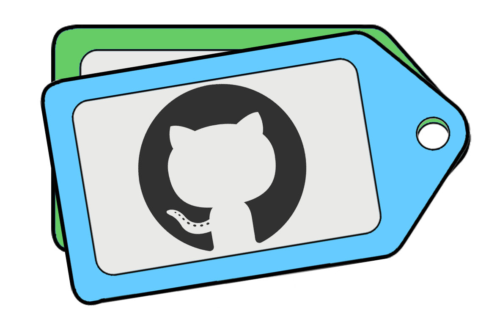

 <p align="center"> 
    
 </p>

**LOOK AWAY** - *still under early development*

# tag-ur-it

A GitHub App Bot to automatically tag issues with labels and assignees based on a rules yml file in the repo

## Development

```sh
# Install dependencies
npm install

# Run typescript
npm run build

# Run the bot
npm start
```

## Contributing

If you have suggestions for how tag-ur-it could be improved, or want to report a bug, open an issue! We'd love all and any contributions.

For more, check out the [Contributing Guide](CONTRIBUTING.md).

## License

[ISC](LICENSE) © 2019 Bryan MacFarlane <bryanmacf@gmail.com> (https://github.com/bryanmacfarlane)

## Credit
Built with [Probot](https://github.com/probot/probot)